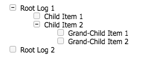

### debug-tree
A simple library for debugging recursive operations with tree like debug
output

### Installation
`$ npm install --save-dev debug-tree`

### Usage
The debug tree library is used with the standard `console` methods (log, info, warn, error). Just pass the first parameter as depth the first parameter.

```javascript
const DebugTree = require('debug-tree');

...
console.log(DebugTree.depth(0), 'Root Log 1');
console.log(DebugTree.depth(1), 'Child Item 1');
console.log(DebugTree.depth(1), 'Child Item 2');
console.log(DebugTree.depth(2), 'Grand-Child Item 1');
console.log(DebugTree.depth(2), 'Grand-Child Item 2');
console.log(DebugTree.depth(0), 'Root Log 2');
```


For the console.log to output to a html file, initialize the DebugTree at the
start of the application (or at the start of your test cases)

```javascript
const DebugTree = require('debug-tree');

DebugTree.start('output.html');

// Use the DebugTree.end() method to end debugging with debug-tree.
// DebugTree.end();
```
